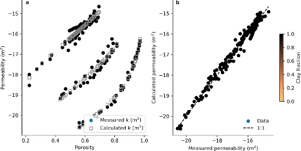
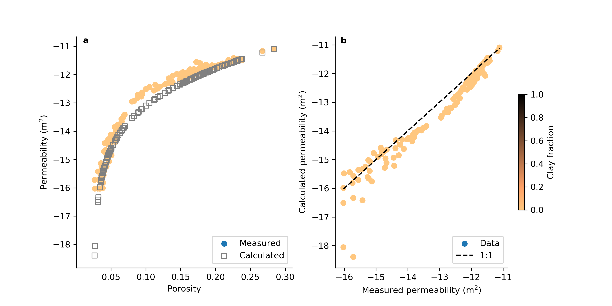
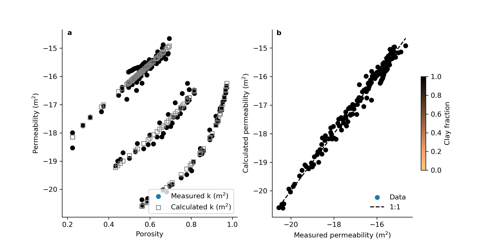
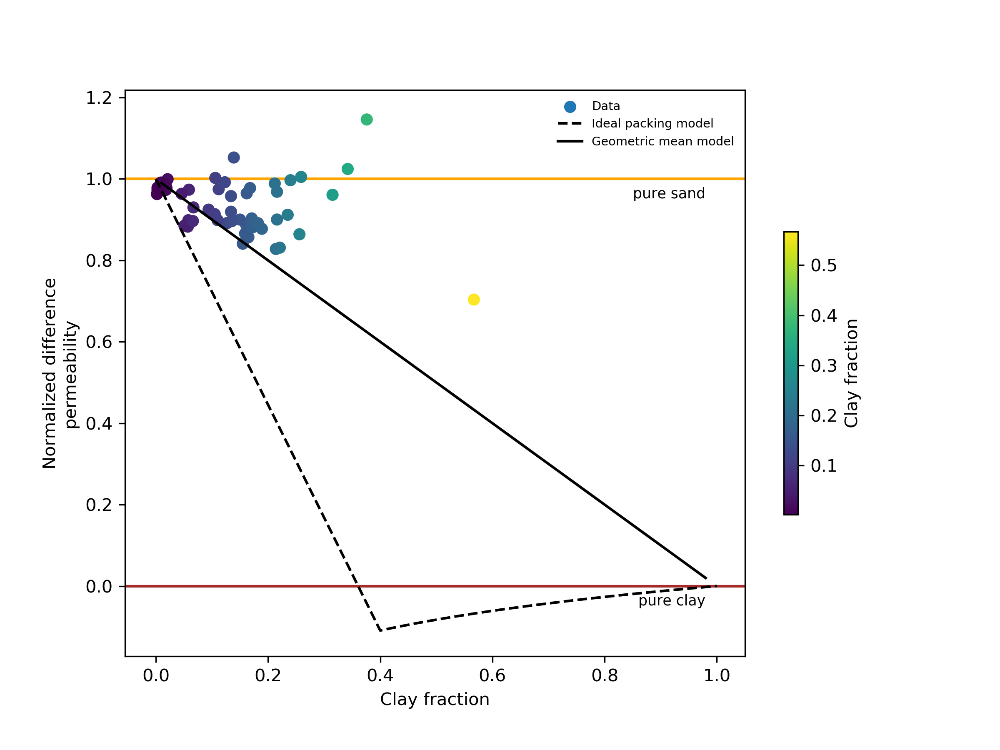

# Permeability notebooks

Jupyter notebooks to calculate the permeability of mixed siliciclastic sediments, following equations published by [Luijendijk and Gleeson (2015)](https://onlinelibrary.wiley.com/doi/full/10.1111/gfl.12115): "How well can we predict permeability in sedimentary basins? Deriving and evaluating porosity-permeability equations for noncemented sand and clay mixtures".

You can use the notebooks to estimate permeability if you have data or estimates on clay content, clay types, porosity, specific surface or grain size distribution of sediment samples. If you happen to have permeability data as well, you could help refine porosity-permeability models for sediments by comparing measured and calculated permeabilities. 

## Calculating permeability

The calculation of permeability follows two steps:

1. If you do not have any data on the specific surface of the non-clay part of your samples, but you do have data on grain size then you first need to calculate the specific surface of the granular (sand, silt) fraction:

	1. If your dataset includes data on grain size distribution, you can use the Jupyter notebook [estimate_specific_surface.ipynb](estimate_specific_surface.ipynb). For an example of how to name columns and organize grain size data see the example dataset [data/porperm_data_well_AST02.csv](data/porperm_data_well_AST02.csv).
	2. If your dataset does not include detailed grain size distribution statistics, but includes statistics on the mean and standard deviation of the grain size or the log-transformed grain size: Use the Jupyter notebook [estimate_specific_surface_from_gs_stats.ipynb](estimate_specific_surface_from_gs_stats.ipynb). For an example of how to name columns and organize grain size data see the example dataset [data/example_dataset_seafloor_sediments.csv](example_dataset_seafloor_sediments.csv). In both cases the notebook saves a new copy of the input dataset with added columns for the calculated specific surface of the granular fraction. The file is saved in the subdirectory [data](data), see for example [data/porperm_data_well_AST02_with_spec_surf.csv](data/porperm_data_well_AST02_with_spec_surf.csv).
	
2. Calculate the permeability of the clay fraction, granular (sand, silt) fraction and the combined permeability of the mixed sediment using the Jupyter notebook [calculate_permeability_sediment_mixtures.ipynb](calculate_permeability_sediment_mixtures.ipynb). The calculated permeability is again added to the input .csv file and saved as a new file in the subdirectory [data](data), see for example [data/porperm_data_well_AST02_with_spec_surf_with_calculated_k.csv](data/porperm_data_well_AST02_with_spec_surf_with_calculated_k.csv).

## Example datasets

Several example sediment permeability datasets are included and can be found in the directory [data](data). All of the datasets are discussed in detail in [Luijendijk and Gleeson (2015)](https://onlinelibrary.wiley.com/doi/full/10.1111/gfl.12115) . The datasets include:
1. A dataset consisting of porosity and permeability data from the clay-free Founainbleau sand [Bourbie & Zinsner 1985](http://dx.doi.org/10.1029/JB090iB13p11524)
2. A compilation of porosity and permeability data for the clay minerals (or mineral groups) kaolinite, illite & smectite (various references).
3. Porosity & permeability data for lab mixtures of kaolinite and uniform sand by [Knoll (1996)](https://open.library.ubc.ca/cIRcle/collections/ubctheses/831/items/1.0052324).
4. a dataset containing porosity & permeability data from a Eocene deltaic sand unit in the Roer Valley Graben in the southern Netherlands: [data/porperm_data_well_AST02.csv](data/porperm_data_well_AST02.csv)
5. A small test dataset with data from marine sediments in the Nankai through from IODP leg 190: [data/example_dataset_seafloor_sediments.csv](example_dataset_seafloor_sediments.csv)

## Figures

The Jupyter notebook generate figures of the grain size distribution, specific surface, measured vs calculated permeability, and normalized permeability, which is a measure of how close the permeability of a particular sample is to the theoretical permeability of its sand or clay components. The figures are saved to the subdirectory [figs](figs), see for example the figures below: 

**Fig caption:** *Comparison of measured and calculated permeability for the Fontainbleau sandstone, which is a clay-free sand with a constant grain size. The measured permeabilities can be relatively well predicted using the Kozeny-Carman equation.*

**Fig caption:** *Comparison of measured and calculated permeability for a compilation of pure clay minerals kaolinite, illite and smectite. The measured permeabilities can be relatively well predicted using empirical power law equations.*

**Fig caption:** *Normalized permeability of mixed sediments from The Roer Valley Graben in the southern Netherlands. The data are somewhat unsurprisingly much more scattered than the pure sand or clay datasets, and overall either the geometric mean or the arithmetic mean of the clay and sand fractions would best predict permeability. The ideal packing model that was developed for lab mixtures of clays and sands does not fit this particular dataset very well. This figure is a simplified version of Fig. 5 in Luijendijk & Gleeson (2015)*

## Input data files:
The main notebook [calculate_permeability_sediment_mixtures.ipynb](calculate_permeability_sediment_mixtures.ipynb) reads input from a .csv file that needs the following columns:

* ``porosity``: Porosity (dimensionless).
* ``permeability_measured``: Measured permeability (m^2)
* ``clay_fraction`` The weight fraction of clay.
* ``kaolinite_fraction``, ``illite_fraction``, ``smectite_fraction``: The weight fractions of the three main types of clays used in Luijendijk & Gleeson (2015). Note that these should add up to 1.0. Also note that you could add additional clay types (chlorite for example, or mixed-layer clays) by updating the line ``clays = ['kaolinite', 'illite', 'smectite']`` and the values for ``k0_clays`` and ``m_clays`` in the notebook.
* ``specific_surface_granular_fraction``: The specific surface of the non-clay material (kg m-3). Note that you can calculate using grain size distributions using either of the two specific surface notebooks.

## Reference

Please cite the following paper if you publish anything that uses these notebook or datasets:

Luijendijk, E., Gleeson, T., 2015. How well can we predict permeability in sedimentary basins? Deriving and evaluating porosity-permeability equations for noncemented sand and clay mixtures. Geofluids 15, 67–83. doi:10.1111/gfl.12115

you can find the paper here: https://onlinelibrary.wiley.com/doi/full/10.1111/gfl.12115

## License
This project is licensed under the GNU lesser general public license (LGPL v3). See the [LICENSE.txt](LICENSE.txt) file for details.
